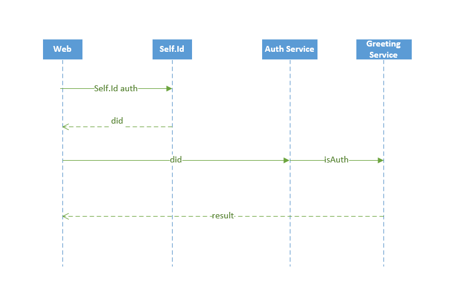

## Overview
SelfId-Auth-Fluence is a hackathon project for Ceramic Self.Id authentication integration with Fluence network using Aqua language and Marine service.

## Components
- FrontEnd

        Web
- Services

        Auth

        Greeting

    ## Web
    Web is the first place to authenticate user identity using Ceramic Self.Id. Web also calls the compiled Aqua script coordinates the authentication process with the did(decentralized identity) retrieved from Self.Id.
    ## Auth
    Auth Service is the Marine authentication service maintains a permission hashmap. After Self.Id authentication is done from Web did is automatically added to auth service hashmap by calling compiled Aqua script. Once user did is contained in the permission hashmap permission can be granted to access the Greeting service.
    ## Greeting
    Greeting is the Marine service user can access once authenticated. It's simply return a hi message with user did.

## Deployed Services on Fluence Testnet
 - Auth Service

        d7b8350b-3b14-4a1b-a66f-59986b48ec20

 - Greeting Service

        b341307b-6f70-4e4f-9b65-f3c18e693490

## YouTube Demo
    www.youtube.com

## License
Unless otherwise indicated, the applicable license is Apache 2.0.